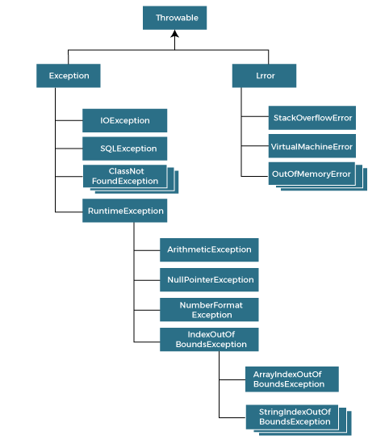
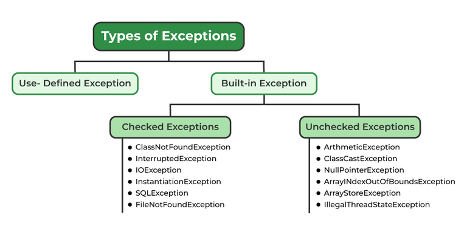

# Exception
Arti kamus: `Exception` adalah kondisi abnormal.

Dalam bahasa Java, `exception` adalah kejadian yang tidak diinginkan atau tidak terduga, yang terjadi selama eksekusi suatu program, yaitu pada saat runtime, yang mengganggu keberjalanan program. `Exception` dapat ditangkap dan ditangani oleh program. Ketika `exception` terjadi dalam suatu method, maka akan menciptakan sebuah objek. Objek ini disebut objek `exception`. Objek ini berisi informasi tentang `exception`, seperti nama dan deskripsi `exception` serta status program saat `exception` terjadi.

Perbedaannya dengan `error` adalah `error` mewakili kondisi yang tidak dapat dipulihkan seperti Java Virtual Machine (JVM) kehabisan memori, kebocoran memori, kesalahan stack overflow, ketidakcocokan library, rekursi tak terbatas, dll. `Error` biasanya di luar kendali programmer.

## Exception Handling
`Exception handling` adalah mekanisme untuk menangani hal-hal unexpected/unwanted saat runtime seperti ClassNotFoundException, IOException, SQLException, RemoteException, dll.

Keuntungan utama dari `exception handling` adalah menjaga keberjalanan program. `Exception` biasanya mengganggu keberjalanan program, untuk itulah kita perlu `exception handling`. Mari kita lihat contoh berikut:

``` java
pernyataan 1;
pernyataan 2;
pernyataan 3;
pernyataan 4;
pernyataan 5; //exception terjadi
pernyataan 6;
pernyataan 7;
pernyataan 8;
pernyataan 9;
pernyataan 10;
```

Misalkan ada 10 pernyataan dalam program Java dan pengecualian terjadi pada pernyataan 5, maka sisa kode tidak akan dieksekusi, yaitu pernyataan 6 sampai 10 tidak akan dieksekusi. Namun, ketika kita melakukan `exception handling`, pernyataan lainnya akan dieksekusi.

## Keywords
Java menyediakan lima kata kunci yang digunakan untuk melakukan `exception handling`. Tabel berikut menjelaskan masing-masingnya.

Keyword                | Deskripsi 
---------------------------- | ------ 
try | Keyword `try` digunakan untuk menentukan blok di mana kita harus menempatkan kode exception. Artinya, kita tidak dapat menggunakan blok `try` sendirian. Blok `try` harus diikuti oleh blok `catch` atau `finally`.
catch | Blok `catch` digunakan untuk menangani exception. Blok ini harus mendahului blok `try`, yang berarti kita tidak dapat menggunakan blok `catch` sendirian. Blok `catch` dapat diikuti oleh blok `finally`.
finally | Blok `finally` digunakan untuk menjalankan kode yang diperlukan dalam program. Blok ini akan dieksekusi apapun yang terjadi setelah `try-catch` blok.
throw | Keyword `throw` digunakan untuk melemparkan (_throw_) exception.
throws | Keyword `throws` digunakan untuk mendeklarasikan exception. Hal ini memberi tahu bahwa mungkin terjadi exception dalam method. Keyword ini tidak melemparkan exception.

## Hirarki dan Tipe dari Exception Class
Class java.lang.Throwable adalah root class dari `exception` yang diwarisi oleh dua subclass: `Exception` dan `Error`. Hierarki dari class Exception adalah sebagai berikut (tidak semua terlampir):



Java mendefinisikan beberapa jenis exception yang berhubungan dengan berbagai class libraries. Java juga memungkinkan pengguna untuk men-define exception mereka sendiri.



## Method dari Exception Class
[Methods](https://docs.oracle.com/javase/7/docs/api/java/lang/Throwable.html) of java.lang.Throwable class

```addSuppressed(), fillInStackTrace(), getCause(), getLocalizedMessage(), getMessage(), getStackTrace(), getSuppressed(), initCause(), printStackTrace(), printStackTrace(), printStackTrace(), setStackTrace(), dan toString().```

[Methods](https://docs.oracle.com/javase/7/docs/api/java/lang/Object.html) of java.lang.Object class

```clone(), equals(), finalize(), getClass(), hashCode(), notify(), notifyAll(), dan wait().```

## Contoh Kasus
Kasus di bawah adalah apabila kita melakukan pembagian dengan 0:

```java
public class JavaExceptionExample{  
    public static void main(String args[]){  
        try{  //kode yang mungkin ada exception
            int data=100/0;  
        } catch(ArithmeticException e){
            System.out.println(e);
        }  
        //kode lainnya yang akan dijalankan   
        System.out.println("rest of the code...");  
    }  
}
```

Output:

```
java.lang.ArithmeticException: / by zero
rest of the code...
```

Kasus di bawah adalah apabila kita mengakses array di luar indeks yang tersedia:

```java
public class JavaExceptionExample{  
    public static void main(String args[]){  
        try{  //kode yang mungkin ada exception
            int a[]=new int[5];  
            a[10]=50; //ArrayIndexOutOfBoundsException
        } catch(ArrayIndexOutOfBoundsException e){
            System.out.println(e);
        }  
        //kode lainnya yang akan dijalankan   
        System.out.println("rest of the code...");  
    }  
}
```

Output:

```
java.lang.ArrayIndexOutOfBoundsException: Index 10 out of bounds for length 5
rest of the code...
```

# Assertion
Sebuah `assertion` dapat menguji kebenaran dari asumsi yang sudah dibuat dalam program. Untuk menggunakan `assertion`, digunakan keyword `assert` dalam bahasa Java. Ketika menjalankan `assertion`, pernyataan tersebut diyakini bernilai benar (_true_). Apabila pernyataan tersebut ternyata salah, JVM akan melempar (_throws_) error bernama AssertionError. `Assertion` biasa digunakan untuk testing ketika melakukan development.

Untuk menggunakan keyword `assert`, dapat menggunakan 2 cara:
```java
assert expression; //cara 1
assert expression1 : expression2; //cara 2
```

Secara default, `assertion` diatur menjadi disabled. Berikut adalah cara mengaktifkannya, jalankan `java –ea <nama file>` atau `java -enableassertions <nama file>` di terminal.

## Contoh Kasus
```java
public class Main {
    public static void main(String[] args) {
        assert false:"Contoh assertion!";
    }
}
```

Apabila assertion diatur menjadi disabled, maka tidak akan muncul output apapun. Namun, apabila diaktifkan, berikut adalah outputnya:

```
Exception in thread "main" java.lang.AssertionError: Contoh assertion!
        at haizk.Main.main(Main.java:5)
```

`haizk.Main.main` adalah tempat di mana method ditempatkan, akan berubah-ubah sesuai dengan lokasi file.

```java
import java.util.Scanner;
public class Main {
    public static void main(String[] args)
    {
        Scanner scanner = new Scanner( System.in );  
        System.out.print("Enter your age: ");  
            
        int value = scanner.nextInt();  
        assert value>=18:" Not valid";  
        
        System.out.println("Your age is "+value);  
        scanner.close();
    }
}
```

Contoh di atas adalah contoh yang lebih nyata. Program akan meminta user untuk menginput angka, apabila user menginput value >= 18, misal 20:

```
Enter your age: 20
Your age is 20
```

Program akan berjalan secara normal. Apabila user menginput value < 18, misal 15:

```
Enter your age: 15
Exception in thread "main" java.lang.AssertionError:  Not valid
        at haizk.Main.main(Main.java:11)
```

Akan muncul exception dan diberi keterangan `Not valid` di mana hal itu adalah `expression 2` pada syntax `assert expression 1 : expression 2;`. Berikut adalah contoh penggabungan dengan `exception handling`:

```java
import java.util.Scanner;
public class Main {
    public static void main(String[] args) {
        try {
            Scanner scanner = new Scanner( System.in );  
            System.out.print("Enter your age: ");  
                
            int value = scanner.nextInt();  
            assert value>=18:" Not valid";  
            
            System.out.println("Your age is "+value);
            scanner.close();
        } catch (AssertionError e) {
            System.out.println("Error: " + e.getMessage());
        }
        System.out.println("Bye");
    }
}
```

```java
Enter your age: 15
Error:  Not valid
Bye
```

Output di atas adalah apabila user menginput value < 18. Apabila user menginput value >= 18, maka outputnya adalah:

```java
Enter your age: 20
Your age is 20
Bye
```

# Baca Lebih Lanjut
1. **Exceptions**:
   - [Lesson: Exceptions (The Java™ Tutorials > Essential Java Classes) - Oracle](https://docs.oracle.com/javase%2Ftutorial%2F/essential/exceptions/index.html)
   - [Exceptions in Java - GeeksforGeeks](https://www.geeksforgeeks.org/exceptions-in-java/)
   - [Java Exceptions - W3Schools](https://www.w3schools.com/java/java_try_catch.asp)
   - [Exception Handling in Java - javatpoint](https://www.javatpoint.com/exception-handling-in-java)
   - [Exception Class in Java - javatpoint](https://www.javatpoint.com/exception-class-in-java)
   - [Throwable (Java Platform SE 7) - Oracle](https://docs.oracle.com/javase/7/docs/api/java/lang/Throwable.html)
   - [Object (Java Platform SE 7) - Oracle](https://docs.oracle.com/javase/7/docs/api/java/lang/Object.html)
   - [Java Custom Exception - javatpoint](https://www.javatpoint.com/custom-exception)
   - [throw and throws in Java - GeeksforGeeks](https://www.geeksforgeeks.org/throw-throws-java/)
2. **Assertions**:
   - [Java Assertion - javatpoint](https://www.javatpoint.com/assertion-in-java)
   - [Assertions in Java - GeeksforGeeks](https://www.geeksforgeeks.org/assertions-in-java/)
   - [How to use assertions in Java - InfoWorld](https://www.infoworld.com/article/3543239/how-to-use-assertions-in-java.html)
   - [Java Assertions - Programiz](https://www.programiz.com/java-programming/assertions)
   - [Programming With Assertions - Oracle](https://docs.oracle.com/javase/8/docs/technotes/guides/language/assert.html#:~:text=An%20assertion%20is%20a%20statement,than%20the%20speed%20of%20light.)
