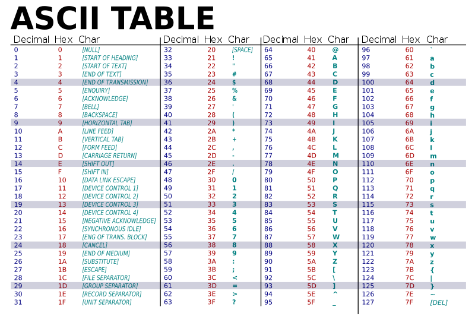

# 5.1 Character Class

Character (char) adalah salah satu type data primitive yang umum terdapat di berbagai macam bahasa pemrograman salah satunya adalah Java. Char hanya dapat menyimpan satu Unicode Character pada satu waktu. Kita bisa melakukan assign dengan cara yang sama ke karakter lainnya baik berupa huruf kecil, huruf kapital, angka, ataupun karakter khusus. Sebagai upaya untuk mencegah permasalahan pada proses pembacaan karakter yang bisa mengakibatkan perbedaan karakter, maka perusahaan komputer di US membuat suatu skema coding yang bernama ASCII (American Standard Code for Information Interchange). Table ASCII dapat dilihat pada gambar berikut.


## 5.1.1 Char Declaration
Character dideklarasikan dengan menggunakan single quotes('').

Contoh penggunaan :

```java
char ch = 'a';

// Unicode for uppercase Greek omega character
char uniChar = '\u039A';
```
## 5.1.2 Escape Sequence
Karakter yang diawali dengan garis miring terbalik `\` merupakan escape sequence dan memiliki arti khusus bagi kompiler. Dengan menggunakan Escape Sequence ini, Anda dapat memasukkan karakter-karakter ini ke dalam teks Anda tanpa mengganggu penafsiran atau pemformatan teks yang salah.

Karakter baris baru `\n` telah sering digunakan dalam pernyataan System.out.println() untuk melanjutkan ke baris berikutnya setelah string dicetak.

Berikut merupakan escape sequence di Java:
Escape Sequence          | Deskripsi 
---------------------------- | ------ 
`\t`       | Menyisipkan karakter tab pada teks di titik ini. Ini digunakan untuk membuat jarak horizontal seperti ketika Anda menekan tombol "Tab" pada keyboard.
`\b`       | Menyisipkan karakter backspace pada teks di titik ini. Ini digunakan untuk menghapus karakter sebelumnya dalam teks.
`\n`       | Menyisipkan karakter newline (baris baru) pada teks di titik ini. Ini digunakan untuk memindahkan teks ke baris berikutnya.
`\r` | Menyisipkan karakter carriage return pada teks di titik ini. Ini sering digunakan bersama dengan newline `\n` untuk membuat baris baru dalam teks.
`\'` | Menyisipkan karakter tanda kutip tunggal (single quote) pada teks di titik ini. Ini digunakan saat Anda ingin mencetak tanda kutip tunggal dalam teks yang diapit oleh tanda kutip tunggal.
`\"`    | Menyisipkan karakter tanda kutip ganda (double quote) pada teks di titik ini. Ini digunakan saat Anda ingin mencetak tanda kutip ganda dalam teks yang diapit oleh tanda kutip ganda.
`\\` |  Menyisipkan karakter backslash pada teks di titik ini. Ini digunakan saat Anda ingin mencetak karakter backslash dalam teks.

# 5.2 String Class

String merupakan sebuah nilai tunggal yang berisikan kumpulan dari character.

## 5.2.1 String Declaration
String di deklarasikan dengan menggunakan double quotes("").

Contoh penggunaan :

```java
String str = "Hello World";
```
Selain itu kita juga dapat membuat String dengan menggunakan keyword "new". Tetapi hal ini jarang digunakan.

Contoh penggunaan :
```java
String anotherString = new String("Hello");

```
## 5.2.2 String Concatenation
Di Java dapat menggabungkan/mengkonket 2 buah string dengan menggunakan operator `+`.
Contoh penggunaan :
```java
String firstName = "John";
String lastName = "Doe";
String fullName = firstName + " " + lastName;
```
Saat Anda perlu melakukan banyak operasi manipulasi string, penggunaan penggabungan String dengan operator `+` bisa menjadi tidak efisien karena pembuatan objek baru. Dalam kasus seperti itu, Anda dapat menggunakan `StringBuilder` atau `StringBuffer` untuk membuat dan memodifikasi string secara efisien. Keduanya mirip dalam fungsionalitas, tetapi memiliki perbedaan utama: `StringBuilder` tidak bersifat thread-safe, sedangkan `StringBuffer` bersifat thread-safe.

Contoh penggunaan stringBuilder :
```java
// Inisialisasi StringBuilder
StringBuilder builder = new StringBuilder();

// Menambahkan teks ke dalam StringBuilder
builder.append("Hello");

// Menambahkan karakter atau string
builder.append(' ');

// Menambahkan lebih banyak teks
builder.append("World!");

// Mengganti karakter di indeks tertentu
builder.setCharAt(0, 'h');

// Menghapus karakter pada indeks tertentu
builder.deleteCharAt(6);

// Mengubah StringBuilder menjadi String
String result = builder.toString();

System.out.println(result); // Output: "hello World!"
```
StringBuilder lebih efisien saat Anda perlu memanipulasi string secara berulang dalam satu thread, seperti dalam pengulangan atau saat menggabungkan banyak string.

Contoh penggunaan stringBuffer :
```java
// Inisialisasi StringBuffer
StringBuffer buffer = new StringBuffer();

// Menambahkan teks ke dalam StringBuffer
buffer.append("Hello");

// Menambahkan karakter atau string
buffer.append(' ');

// Menambahkan lebih banyak teks
buffer.append("World!");

// Mengganti karakter di indeks tertentu
buffer.setCharAt(0, 'h');

// Menghapus karakter pada indeks tertentu
buffer.deleteCharAt(6);

// Mengubah StringBuffer menjadi String
String result = buffer.toString();

System.out.println(result); // Output: "hello World!"
```
`StringBuffer`, meskipun sedikit lebih lambat dalam penggunaan tunggal, berguna dalam lingkungan `multithread` karena bersifat thread-safe, sehingga dapat digunakan secara aman dalam konteks bersamaan oleh beberapa thread.

## 5.2.3 String Method
Di bahasa pemrograman Java terdapat beberapa build-in method pada String Class yang dapat membantu kita dalam memproses informasi dari String.
Berikut beberapa contoh String Method :
### 1. CharAt()
Method `ChatAt()` digunakan untuk mengembalikan sebuah character dari sebuah String pada indek tertentu.
Contoh penggunaan :
```java
String text = "Hello, World!";
char character = text.charAt(0); // Mengambil karakter pertama 'H'
System.out.println(character);
```
### 2. compareTo()
Metode `compareTo()` digunakan untuk membandingkan urutan leksikal antara dua string. Itu mengembalikan nilai negatif jika string pertama lebih kecil, nilai positif jika string pertama lebih besar, dan 0 jika kedua string sama.
Contoh penggunaan :
```java
String str1 = "apple";
String str2 = "banana";
int result = str1.compareTo(str2); // Menghasilkan nilai negatif
System.out.println(result);
```
### 3. toLowerCase() dan toUpperCase()
Metode `toLowerCase()` digunakan untuk mengonversi semua karakter dalam string menjadi huruf kecil, sedangkan `toUpperCase()` mengonversi semua karakter menjadi huruf besar.
Contoh penggunaan :
```java
String text = "Hello, World!";
String lowercaseText = text.toLowerCase();
String uppercaseText = text.toUpperCase();
System.out.println(lowercaseText); // hello, world!
System.out.println(uppercaseText); // HELLO, WORLD!
```
### 4. startsWith() dan endsWith()
Metode `startsWith()` digunakan untuk memeriksa apakah string dimulai dengan substring tertentu. `endsWith()` digunakan untuk memeriksa apakah string diakhiri dengan substring tertentu.
```java
String text = "Hello, World!";
boolean startsWithHello = text.startsWith("Hello"); // true
boolean endsWithWorld = text.endsWith("World!"); // true
System.out.println(startsWithHello);
System.out.println(endsWithWorld);
```
### 5. split()
Metode `split()` digunakan untuk membagi string menjadi potongan-potongan berdasarkan suatu pemisah (separator) dan mengembalikan array string.
```java
String sentence = "Java is a powerful programming language";
String[] words = sentence.split(" "); // Memecah berdasarkan spasi
for (String word : words) {
    System.out.println(word);
}
```
## 5.3 Regular Expression
Ekspresi Reguler (Regular Expression), sering disingkat sebagai regex atau regexp, adalah alat yang kuat untuk pencocokan pola dan pencarian dalam string. Dalam bahasa pemrograman Java, ekspresi reguler didukung melalui build-in package `java.util.regex`. Regular Expression memungkinkan untuk mendefinisikan pola yang dapat digunakan untuk mencocokkan dan mencari teks dalam string. Ini sangat berguna untuk tugas seperti validasi data, ekstraksi teks, dan analisis sintaks.

Package java.util.regex menyediakan dua kelas utama: Pattern dan Matcher. Kelas Pattern mewakili ekspresi reguler yang telah dikompilasi, sementara kelas Matcher digunakan untuk melakukan operasi pencocokan pada string input yang diberikan.

Contoh penggunaan Pattern dan Matcher dari Regex pada Java :
```java
//Pembuatan Pattern  atau pola
Pattern pola = Pattern.compile("\\d{3}-\\d{2}-\\d{4}");

//Pembuatan Matcher atau pencocokan
Matcher pencocok = pola.matcher("123-45-6789");
boolean cocok = pencocok.matches(); // Mengembalikan true

```

## 5.3.1 Method find() pada Regular Expression
Metode `find()` dari kelas Matcher mencari kemunculan pertama pola dalam string input. Metode ini mengembalikan true jika ada pattern yang sama pada matcher dan false jika tidak ada string sesuai pattern pada matcher.

Contoh penggunaan:
```java
Pattern pola = Pattern.compile("\\d{3}-\\d{2}-\\d{4}");
Matcher pencocok = pola.matcher("Nomor KTP saya adalah 123-45-6789.");
if (pencocok.find()) {
    System.out.println("Ditemukan Nomor KTP: " + pencocok.group()); // Mencetak "Ditemukan Nomor KTP: 123-45-6789"
}
```

## 5.3.2 Regular Expressions Pattern
Parameter pertama dari Pattern.compile() nethod adakah pola/pattern yang mendeskripsikan apa yang sedang dicari.

Berikut contoh penyusunan pola yang biasa digunakan :
Bentuk Pola             | Deskripsi 
---------------------------- | ------ 
`[abc]`	| digunakan untuk mencocokkan satu karakter yang bisa berupa salah satu dari karakter yang ada dalam tanda kurung siku [abc]. Misalnya, [abc]at akan mencocokkan string "cat", "bat", atau "aat", tetapi tidak akan mencocokkan "rat" karena huruf "r" tidak termasuk dalam opsi di dalam tanda kurung siku.
`[^abc]` | digunakan untuk mencocokkan satu karakter yang tidak ada dalam tanda kurung siku [^abc]. Misalnya, [^abc]at akan mencocokkan string "rat" karena huruf "r" tidak termasuk dalam opsi di dalam tanda kurung siku, tetapi tidak akan mencocokkan "cat" atau "bat" karena huruf "c" dan "b" termasuk dalam opsi tersebut.
`[0-9]`	|  digunakan untuk mencocokkan satu karakter yang berada dalam rentang angka dari 0 hingga 9. Misalnya, [0-9]x akan mencocokkan string "1x", "5x", atau "9x", tetapi tidak akan mencocokkan "ax" karena "a" bukan angka dalam rentang tersebut.

Braket `[ ]` diatas digunakan untuk mendefinisikan range dari charactersnya.
### 5.3.2.1 Metacharacters
`Metacharacters` adalah characters yang memiliki arti tersendiri.

Berikut contoh dari metacharacter yang dapat digunakan untuk pembuatan sebuah pattern:
Metacharacter             | Deskripsi 
---------------------------- | ------ 
`\|` | Metacharacter ini digunakan untuk mencocokkan salah satu pola yang dipisahkan oleh tanda `\|`. Misalnya, `cat\|dog\|fish` akan mencocokkan string yang mengandung salah satu dari kata-kata tersebut.
`.`	| Metacharacter ini digunakan untuk mencocokkan satu karakter apa pun. Sebagai contoh, `c.t` akan mencocokkan string seperti "cat", "cut", atau "cot".
`^`	| Metacharacter ini digunakan untuk mencocokkan awal dari sebuah string. Misalnya, `^Hello` akan mencocokkan string yang dimulai dengan "Hello"
`$`	| Metacharacter ini digunakan untuk mencocokkan akhir dari sebuah string. Sebagai contoh, `World$` akan mencocokkan string yang diakhiri dengan "World".
`\d` | Metacharacter ini digunakan untuk mencocokkan angka digit. Misalnya, `\d\d` akan mencocokkan dua digit berturut-turut dalam sebuah string.
`\s` |  Metacharacter ini digunakan untuk mencocokkan karakter spasi (whitespace), seperti spasi atau karakter tab.
`\b` |  Metacharacter ini digunakan untuk mencocokkan awal atau akhir dari sebuah kata. Misalnya, `\bWORD` akan mencocokkan kata yang dimulai dengan "WORD", sedangkan `WORD\b` akan mencocokkan kata yang diakhiri dengan "WORD".
`\uxxxx` | Metacharacter ini digunakan untuk mencocokkan karakter Unicode yang ditentukan oleh nomor heksadesimal xxxx.

### 5.3.2.2 Quantifiers
Quantifiers dalam pembuatan pola (pattern) dalam ekspresi reguler digunakan untuk mengontrol berapa kali sebuah karakter atau grup karakter tertentu harus muncul dalam string yang dicocokkan. Berikut adalah beberapa quantifier yang umum digunakan dalam ekspresi reguler:
Quantifier           | Deskripsi 
---------------------------- | ------ 
`*`       | Quantifier `*` mengindikasikan bahwa karakter atau grup karakter sebelumnya dapat muncul 0 kali atau lebih. Misalnya, `a*` akan cocok dengan string kosong, "a", "aa", "aaa", dan seterusnya.
`+`       | Quantifier `+` mengindikasikan bahwa karakter atau grup karakter sebelumnya harus muncul setidaknya satu kali atau lebih. Misalnya, `a+` akan cocok dengan "a", "aa", "aaa", dan seterusnya, tetapi tidak akan cocok dengan string kosong.
`?`       | Quantifier `?` mengindikasikan bahwa karakter atau grup karakter sebelumnya dapat muncul 0 kali atau tepat 1 kali. Misalnya, `a?` akan cocok dengan string kosong atau "a", tetapi tidak akan cocok dengan "aa".
`{n}` | Quantifier `{n}` mengindikasikan bahwa karakter atau grup karakter sebelumnya harus muncul tepat n kali. Misalnya, `a{3}` akan cocok dengan "aaa" tetapi tidak akan cocok dengan "aa" atau "a".
`{n,}`     | Quantifier `{n,}` mengindikasikan bahwa karakter atau grup karakter sebelumnya harus muncul setidaknya n kali atau lebih. Misalnya, `a{2,}` akan cocok dengan "aa", "aaa", "aaaa", dan seterusnya.
`{n,m}`    | Quantifier `{n,m}` mengindikasikan bahwa karakter atau grup karakter sebelumnya harus muncul setidaknya n kali dan paling banyak m kali. Misalnya, `a{2,4}` akan cocok dengan "aa", "aaa", atau "aaaa", tetapi tidak akan cocok dengan "a" atau "aaaaa".


### Contoh Kasus

```java
public class RegEx {
    public static void main(String[] args) {
        String strPat = "12[987]34"; //string harus dimulai dengan "12", diikuti oleh salah satu karakter yang merupakan salah satu dari "9", "8", atau "7", dan diakhiri dengan "34"
        String str1 = "12934";
        String str2 = "129834";
        String str3 = "12734";

        System.out.println("str1: " + str1.matches(strPat));
        System.out.println("str2: " + str2.matches(strPat));
        System.out.println("str3: " + str3.matches(strPat));

        String strPat2 = "A[a-z0-9][A-Z]";
        String str4 = "AzH";
        String str5 = "A3H";
        String str6 = "A+H";
        System.out.println("str4: " + str4.matches(strPat2));
        System.out.println("str5: " + str5.matches(strPat2));
        System.out.println("str6: " + str6.matches(strPat2));

        String strPat3 = "abc[a-z&&[^e-j]]";
        String str7 = "abcd";
        String str8 = "abcf";
        System.out.println("str7: " + str7.matches(strPat3));
        System.out.println("str8: " + str8.matches(strPat3));

        String strPat4 = "A{2}[0-9]{3,4}";
        String str9 = "AA123";
        String str10 = "A123";
        String str11 = "AA873495";
        System.out.println("str9: " + str9.matches(strPat4));
        System.out.println("str10: " + str10.matches(strPat4));
        System.out.println("str11: " + str11.matches(strPat4));

        String strPat5 = "(Hai |Hello ){2}(Dunia|World)";
        String str12 = "Hello Hai World";
        String str13 = "Hai Dunia";
        System.out.println("str12: " + str12.matches(strPat5));
        System.out.println("str13: " + str13.matches(strPat5));
    }
}
```
Output :
```java
str1: true
str2: false
str3: true
str4: true
str5: true
str6: false
str7: true
str8: false
str9: true
str10: false
str11: false
str12: true
str13: false
```
Penjelasan :

1. strPat: Pattern ini adalah "12[987]34". Ini berarti string harus dimulai dengan "12", diikuti oleh salah satu karakter yang merupakan salah satu dari "9", "8", atau "7", dan diakhiri dengan "34". Pemeriksaan dilakukan dengan menggunakan metode .matches().
Hasil pemeriksaan:
- str1 cocok karena "12934" sesuai dengan pola.
- str2 tidak cocok karena "129834" memiliki karakter tambahan di tengah-tengah pola.
- str3 cocok karena "12734" memiliki karakter "7" di tengah-tengah pola.

2. strPat2: Pattern ini adalah "A[a-z0-9][A-Z]". Ini berarti string harus dimulai dengan "A", diikuti oleh satu karakter alfanumerik kecil atau angka, dan diakhiri dengan satu karakter huruf besar.
Hasil pemeriksaan:
- str4 cocok karena "AzH" sesuai dengan pola.
- str5 cocok karena "A3H" memiliki angka di tengah-tengah pola.
- str6 tidak cocok karena "A+H" memiliki karakter tambahan di tengah-tengah pola.

3. strPat3: Pattern ini adalah "abc[a-z&&[^e-j]]". Ini berarti string harus dimulai dengan "abc", diikuti oleh satu karakter kecil yang bukan merupakan "e" sampai "j".
Hasil pemeriksaan:
- str7 cocok karena "abcd" sesuai dengan pola.
- str8 tidak cocok karena "abcf" memiliki karakter "f" yang termasuk dalam rentang "e" sampai "j".

4. strPat4: Pattern ini adalah "A{2}[0-9]{3,4}". Ini berarti string harus dimulai dengan tepat dua karakter "A", diikuti oleh tiga atau empat digit angka.
Hasil pemeriksaan:
- str9 cocok karena "AA123" sesuai dengan pola.
- str10 tidak cocok karena "A123" memiliki hanya satu karakter "A".
- str11 tidak cocok karena "AA873495" tidak sesuai dengan pola kare angka setelah AA terdapat sebanyak 6.

5. strPat5: Pattern ini adalah "(Hai |Hello ){2}(Dunia|World)". Ini berarti string harus mengandung dua pengulangan dari salah satu dari dua pilihan: "Hai " atau "Hello ", diikuti oleh salah satu dari dua pilihan: "Dunia" atau "World".
Hasil pemeriksaan:
- str12 cocok karena "Hello Hai World" sesuai dengan pola.
- str13 tidak cocok karena "Hai Dunia" tidak sesuai dengan pola pada kata Hai/Helo hanya terdapat 1 kali.

# Baca Lebih Lanjut
1. **Character Class**:
   - [Class Character - Oracle](https://docs.oracle.com/javase/8/docs/api/java/lang/Character.html)
   - [Java - Character Class - Tutorialspoint](https://www.tutorialspoint.com/java/java_characters.htm)
   - [Character Class in Java - GeeksforGeeks](https://www.geeksforgeeks.org/character-class-java/)
2. **String Class**:
   - [Class String - Oracle](https://docs.oracle.com/javase%2F7%2Fdocs%2Fapi%2F%2F/java/lang/String.html)
   - [String Class in Java - GeeksforGeeks](https://www.geeksforgeeks.org/string-class-in-java/)
   - [Java String - javaTpoint](https://www.javatpoint.com/java-string)
   - [Java - Strings Class - Tutorialspoint](https://www.tutorialspoint.com/java/java_strings.htm)
3. **Regular Expression**
   - [Java - Regular Expressions - Tutorialspoint](https://www.tutorialspoint.com/java/java_regular_expressions.htm)
   - [Java Regex - javaTpoint](https://www.javatpoint.com/java-regex)
   - [Lesson: Regular Expressions - Oracle](https://docs.oracle.com/javase/tutorial/essential/regex/)
   


