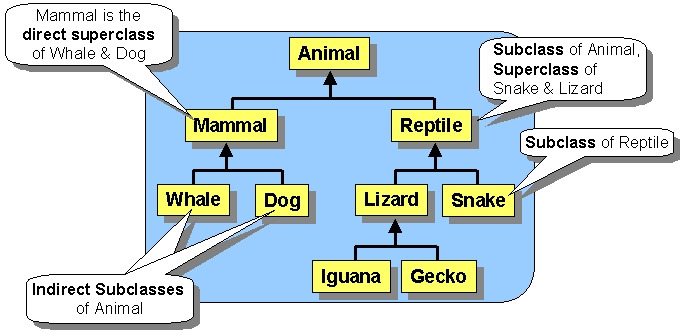

# Inheritance
**Inheritance** (Pewarisan/Warisan) adalah konsep dalam pemrograman berorientasi objek yang memungkinkan kita dapat membuat class baru berdasarkan class yang sudah ada. Di Java, **inheritance** memungkinkan kira membuat class baru (subclass atau child class) dengan mewarisi **properties** dan **methods** class yang sudah ada (superclass atau parent class).

Mungkin ada yang bertanya apa perbedaan **inheritance** dan **polymorphism**, **inheritance** adalah konsep yang memungkinkan kita membuat class baru berdasarkan class yang sudah ada, sedangkan **polymorphism** adalah konsep yang memungkinkan kita dapat menggunakan objek dengan cara yang **berbeda**, bergantung pada class apa yang digunakan untuk membuat objek tersebut. Berikut beberapa hal penting yang perlu diketahui tentang **inheritance** di Java.

## Class Hierarchies
**Class hierarchies** (hirarki class) adalah struktur class yang terbentuk dari **inheritance**. Dengan **inheritance** kita dapat membuat class baru berdasarkan class yang sudah ada, dan class baru tersebut dapat digunakan untuk membuat **class baru lagi**. Dengan cara ini, kita dapat membuat struktur class yang terdiri dari class-class yang saling berhubungan satu sama lain. Class yang berada di atas dalam struktur class disebut **superclass** atau **parent class**, sedangkan class yang berada di bawah disebut **subclass** atau **child class**. Berikut contoh struktur class yang terbentuk dari **inheritance**.


## Object Class
**Object class** adalah class yang menjadi **parent class** dari semua class di Java. Class ini memiliki **properties** dan **methods** yang dapat digunakan oleh semua class di Java, seperti **toString()**, **equals()**, dan lain-lain. 

## Inheritance Syntax (Keyword)
Untuk membuat class baru berdasarkan class yang sudah ada, kita dapat menggunakan kata kunci **extends** diikuti dengan nama class yang ingin kita warisi. Berikut contoh sintaks **inheritance** di Java.
```java
class Subclass extends Superclass {
    // ...
}
```
Dalam contoh di atas, class **Subclass** mewarisi **properties** dan **methods** dari class **Superclass**. Class **Subclass** dapat digunakan untuk membuat class baru lagi, dan class baru tersebut akan mewarisi **properties** dan **methods** dari class **Subclass** dan **Superclass**.

## Access Modifiers
Kita dapat menggunakan **access modifiers** untuk mengatur **accessibility** dari **properties** dan **methods** yang diwarisi. Berikut contoh penggunaan **access modifiers** pada **properties** dan **methods** yang diwarisi.
```java
class Superclass {
    public int publicProperty;
    protected int protectedProperty;
    private int privateProperty;

    public void publicMethod() {
        // ...
    }

    protected void protectedMethod() {
        // ...
    }

    private void privateMethod() {
        // ...
    }
}

class Subclass extends Superclass {
    // ...
}
```
Dalam contoh di atas, **properties** dan **methods** yang diwarisi memiliki **accessibility** yang berbeda-beda. **Properties** dan **methods** yang memiliki **accessibility** **public** dapat diakses dari mana saja, sedangkan **properties** dan **methods** yang memiliki **accessibility** **protected** hanya dapat diakses dari class yang sama atau class yang **mewarisi** class tersebut, dan **properties** dan **methods** yang memiliki **accessibility** **private** hanya dapat diakses dari dalam class.

## Method Overriding
**Method overriding** adalah konsep yang memungkinkan kita dapat membuat **method** baru dengan nama yang sama dengan **method** yang sudah ada di **superclass**. Dengan cara ini, kita dapat membuat **method** baru yang memiliki **behavior** yang berbeda dengan **method** yang sudah ada di **superclass**. Berikut contoh **method overriding**.
```java
class Superclass {
    public void method() {
        System.out.println("Superclass method");
    }
}

class Subclass extends Superclass {
    public void method() {
        System.out.println("Subclass method");
    }
}
```
Dalam contoh di atas, class **Subclass** memiliki **method** dengan nama yang sama dengan **method** yang sudah ada di **Superclass**. **Method** baru tersebut memiliki **behavior** yang berbeda dengan **method** yang sudah ada di **Superclass**. Berikut contoh penggunaan **method overriding**.
```java
class Main {
    public static void main(String[] args) {
        Superclass superclass = new Superclass();
        superclass.method(); // Superclass method

        Subclass subclass = new Subclass();
        subclass.method(); // Subclass method

        Superclass subclassAsSuperclass = new Subclass();
        subclassAsSuperclass.method(); // Subclass method
    }
}
```
Output:
```java
Superclass method
Subclass method
Subclass method
```
Dapat dilihat pada contoh di atas, subclass **diassign** ke dalam superclass. Hal ini dimungkinkan karena subclass **mewarisi** superclass. Dengan cara ini, kita dapat menggunakan subclass sebagai superclass. Namun, kita perlu berhati-hati karena subclass memiliki **properties** dan **methods** yang berbeda dengan superclass. Materi lebih lanjut akan dibahas pada materi **Polymorphism**.

## Method Overloading
**Method overloading** adalah konsep yang memungkinkan kita dapat membuat **method** baru dengan nama yang sama dengan **method** yang sudah ada di **superclass**. Dengan cara ini, kita dapat membuat **method** baru yang memiliki **parameter** yang berbeda dengan **method** yang sudah ada di **superclass**. Berikut contoh **method overloading**.
```java
class Superclass {
    public void method() {
        System.out.println("Superclass method");
    }

    public void method(int number) {
        System.out.println("Superclass method with parameter");
    }
}

class Subclass extends Superclass {
    public void method() {
        System.out.println("Subclass method");
    }

    public void method(int number) {
        System.out.println("Subclass method with parameter");
    }

    public void method(float number) {
        System.out.println("Subclass method with parameter");
    }
}
```
Materi lebih lanjut akan dibahas pada materi **Polymorphism**.


## Final Keyword
**Final keyword** adalah keyword yang digunakan untuk mengubah **properties** dan **methods** agar tidak dapat diubah lagi. Apabila sebuah class diberi keyword **final**, maka class tersebut **tidak dapat diwarisi**. Sebuah **method** yang diberi keyword **final** tidak dapat di **override** oleh subclass. Sebuah **properties** yang diberi keyword **final** tidak dapat diubah nilainya setelah diinisialisasi.

## Super Keyword
**Super keyword** adalah keyword yang digunakan untuk mengakses **properties** dan **methods** dari **superclass**. Berikut contoh penggunaan **super keyword**.
```java
class Superclass {
    public void method() {
        System.out.println("Superclass method");
    }
}

class Subclass extends Superclass {
    public void method() {
        super.method();
        System.out.println("Subclass method");
    }
}

class Main {
    public static void main(String[] args) {
        Subclass subclass = new Subclass();
        subclass.method();
    }
}
```
Output:
```java
Superclass method
Subclass method
```
Dalam contoh di atas, **method** di **subclass** menggunakan **super keyword** untuk mengakses **method** di **superclass**. Dengan cara ini, kita dapat menggunakan **method** di **superclass** tanpa harus membuat **method** baru di **subclass**. Berikut contoh penggunaan **super keyword**.
```java
class Superclass {
    public int number = 10;
}
class Subclass extends Superclass {
    public int number = 20;

    public void method() {
        System.out.println(number); // 20
        System.out.println(super.number); // 10
    }
}
class Main {
    public static void main(String[] args) {
        Subclass subclass = new Subclass();
        subclass.method();
    }
}
```
Output:
```java
20
10
```
Contoh lain:
```java
class Superclass {
    public int number = 10;
}
class Subclass extends Superclass {
    public void method() {
        System.out.println(number); // 10
        System.out.println(super.number); // 10
    }
}
class Main {
    public static void main(String[] args) {
        Subclass subclass = new Subclass();
        subclass.method();
    }
}
```
Output:
```java
10
10
```
Apabila tidak terdapat **properties** atau **methods** dengan nama yang sama di **subclass**, maka ada atau tidaknya **keyword super** tidak memengaruhi pengaksesan **properties** atau **methods**, kode akan memanggil **properties** atau **methods** yang ada di **superclass** secara **otomatis**.

Jadi, konsepnya, apabila tidak menggunakan **keyword super**, maka kode akan mencari **properties** atau **methods** dengan nama yang sama di **subclass** terlebih dahulu, apabila tidak ditemukan, maka kode akan mencari di **superclass**.

## Constructor
**Constructor** adalah **method** yang digunakan untuk menginisialisasi **properties** dari sebuah class. Dalam **inheritance**, **subclass** akan memanggil **constructor** dari **superclass** terlebih dahulu sebelum menginisialisasi **properties** dari **subclass**. Berikut contoh penggunaan **constructor** di **inheritance**.
```java
class Superclass {
    public Superclass() {
        System.out.println("Superclass constructor");
    }
}

class Subclass extends Superclass{
    public Subclass() {
        System.out.println("Subclass constructor");
    }
}

class Main {
    public static void main(String[] args) {
        Subclass subclass = new Subclass();
    }
}
```
Output:
```java
Superclass constructor
Subclass constructor
```
Contoh lain:
```java
class Superclass {
    public Superclass() {
        System.out.println("Superclass constructor");
    }
    public Superclass(int a) {
        System.out.println("Superclass constructor with parameter, a value: " + a);
    }
}

class Subclass extends Superclass{
    public Subclass() {
        System.out.println("Subclass constructor");
    }

    public Subclass(int a) {
        System.out.println("Subclass constructor with an int parameter");
    }

    public Subclass(float a) {
        super((int)a);
        System.out.println("Subclass constructor with a float parameter");
    }

    public Subclass(int a, int b) {
        System.out.println("Subclass constructor with two parameters");
    }
}

class Main {
    public static void main(String[] args) {
        Subclass subclass1 = new Subclass();
        Subclass subclass2 = new Subclass(10);
        Subclass subclass3 = new Subclass(20.5f);
        Subclass subclass4 = new Subclass(10, 20);
    }
}
```
Output:
```java
Superclass constructor
Subclass constructor
Superclass constructor
Subclass constructor with an int parameter
Superclass constructor with parameter, a value: 20
Subclass constructor with a float parameter
Superclass constructor
Subclass constructor with two parameters
```
Dapat dilihat pada contoh di atas, apabila **constructor** pada **subclass** tidak mem-spesifikkan **constructor** mana yang akan dipanggil pada **superclass**, maka **constructor** tanpa parameter akan dipanggil secara **otomatis**. Apabila **constructor** pada **class** mem-spesifikkan **constructor** mana yang akan dipanggil, maka **constructor** yang dipanggil adalah **constructor** yang dispesifikkan. Untuk mem-spesisfikkan **constructor** mana yang akan dipanggil, kita dapat menggunakan **super keyword** diikuti dengan **parameter** yang sesuai dengan **constructor** yang ingin dipanggil.

Contoh **yang salah**:
```java
class Superclass {
    public Superclass(int a) {
        System.out.println("Superclass constructor with parameter, a value: " + a);
    }
}

class Subclass extends Superclass{
    public Subclass(int a) {
        System.out.println("Subclass constructor with an int parameter");
    }
}

class Main {
    public static void main(String[] args) {
        Subclass subclass = new Subclass(10);
    }
}
```
Output:
```java
ERROR!
```
Hal ini terjadi karena **constructor** pada **subclass** mencoba memanggil **constructor** pada **superclass** tanpa parameter, yang mana **tidak ada**.

## Destructor
**Destructor** adalah **method** yang digunakan untuk menghapus **properties** dari sebuah class. Walaupun pada bahasa Java tidak terdapat **destructor**, namun kita dapat menggunakan **finalize()** untuk menggantikan **destructor**.

Dalam **inheritance**, **subclass** akan memanggil **destructor** dari **subclass** terlebih dahulu sebelum menghapus **properties** dari **superclass**. **Destructor** tidak dapat dipanggil secara langsung, **destructor** akan dipanggil secara **otomatis** ketika sebuah objek dihapus dari memori. Berikut contoh penggunaan **destructor** di **inheritance**.
```java
class Superclass {
    public Superclass() {
        System.out.println("Superclass constructor");
    }

    public void finalize() {
        System.out.println("Superclass destructor");
    }
}

class Subclass extends Superclass {
    public Subclass() {
        System.out.println("Subclass constructor");
    }

    public void finalize() {
        System.out.println("Subclass destructor");
    }
}

class Main {
    public static void main(String[] args) {
        Subclass subclass = new Subclass();
        subclass = null;
        System.gc(); // Call garbage collector
    }
}
```
Output dari contoh di atas adalah indeterministic,karena **garbage collector** bisa saja **tidak langsung** menghapus objek dari memori. Berikut adalah outputnya apabila **garbage collector** langsung menghapus objek dari memori.
```java
Superclass constructor
Subclass constructor
Subclass destructor
Superclass destructor
```

## An Example of Using the Static Keyword in the Context of Inheritance
**Static keyword** adalah keyword yang digunakan untuk membuat **properties** dan **methods** yang dapat diakses tanpa harus membuat objek terlebih dahulu, dan membuat **properties** dan **methods** menjadi terikat kepada **class** bukan **objek**. Berikut contoh penggunaan **static keyword** dalam konsep **inheritance**.
```java
class Animal {
    static int numberOfAnimals = 0;
    String name;

    public Animal(String name) {
        this.name = name;
        numberOfAnimals++;
    }

    public void animalInfo() {
        System.out.println("Animal: " + name);
    }
}

class Dog extends Animal {
    public Dog(String name) {
        super(name);
    }
}

class Cat extends Animal {
    public Cat(String name) {
        super(name);
    }
}

class Main {
    public static void main(String[] args) {
        Dog dog1 = new Dog("Buddy");
        dog1.animalInfo();
        Dog dog2 = new Dog("Max");
        dog2.animalInfo();
        Cat cat1 = new Cat("Whiskers");
        cat1.animalInfo();

        System.out.println("Total number of animals: " + Animal.numberOfAnimals);
    }
}

```
Output:
```java
Animal: Buddy
Animal: Max
Animal: Whiskers
Total number of animals: 3
```