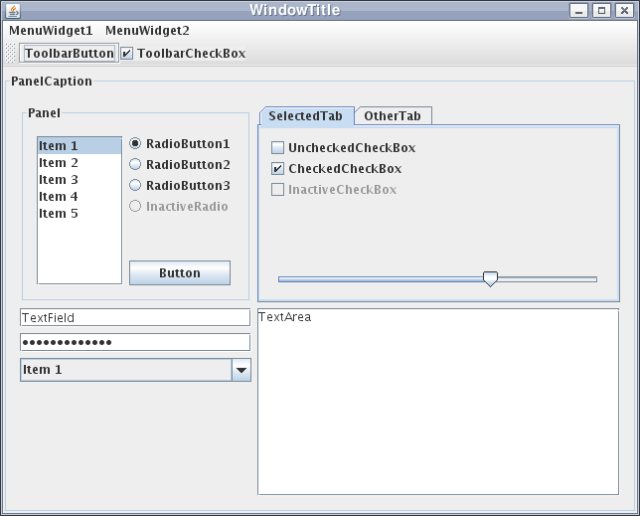
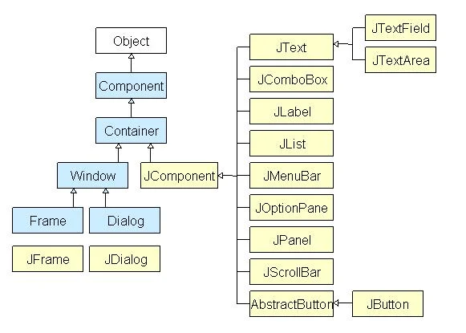
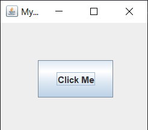
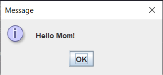

# GUI Programming

## Konsep Dasar
Pada dasarnya, Java hanya dikenal dengan Java Console yang di mana program Java hanya dapat dijalankan pada konsol saja. Kemudian Java semakin berkembang, hingga terciptanya Java GUI (**Graphic User Interface**). GUI bertujuan untuk menambahkan beberapa objek yang tidak bisa dibuat dalam basis text. Objek–objek tersebut bisa berupa tombol, gambar, dan lain-lain. Tujuannya adalah untuk memudahkan user menggunakan program yang dibuat tersebut.

Secara umum, GUI adalah interaksi yang dapat dilaksanakan oleh user melalui menu dan icon yang diperlihatkan dalam modus grafik. Contoh implementasi GUI-based shell adalah sistem operasi Microsoft Windows. Berikut contoh program dengan menggunakan Java GUI:


## GUI pada Java
Java memunyai banyak library untuk membuat GUI, seperti AWT (Abstract Window Toolkit), Swing, JavaFX, SWT (Standard Widget Toolkit), Java Native Access (JNA), JGoodies, Apache Pivot, dan lain-lain. Banyak hal yang bisa dipertimbangkan dalam memilih library GUI, seperti kebutuhan, kecepatan, kemudahan, dan lain-lain. Pada materi ini, kita akan menggunakan **Swing**.

## Swing
Swing adalah library GUI yang dikembangkan oleh Sun Microsystems. Swing menyediakan komponen-komponen GUI yang lebih fleksibel dan dapat diubah-ubah tampilannya. Swing juga mendukung pluggable look and feel, yang memungkinkan kita untuk mengubah tampilan GUI sesuai dengan keinginan kita. Swing juga mendukung MVC (Model View Controller) yang memungkinkan kita untuk memisahkan antara tampilan dengan logika program. Swing juga mendukung drag and drop, clipboard, dan lain-lain. Berikut adalah hirarki dari Swing:



## Contoh Program
Berikut adalah contoh program sederhana dengan menggunakan Swing:

```java
import javax.swing.*;

public class App {
    public static void main(String[] args) {
        JFrame frame = new JFrame("My Swing App");
        JButton button = new JButton("Click Me");

        button.setBounds(50, 50, 100, 50);

        frame.add(button);
        frame.setSize(210, 180);
        frame.setLayout(null);
        frame.setVisible(true);
        frame.setDefaultCloseOperation(JFrame.EXIT_ON_CLOSE);
    }
}
```

Penjelasan:
- `JFrame frame = new JFrame("My Swing App");` digunakan untuk membuat frame dengan judul "My Swing App".
- `JButton button = new JButton("Click Me");` digunakan untuk membuat button dengan tulisan "Click Me".
- `button.setBounds(50, 50, 100, 50);` digunakan untuk mengatur posisi dan ukuran button.
- `frame.add(button);` digunakan untuk menambahkan button ke dalam frame.
- `frame.setSize(210, 180);` digunakan untuk mengatur ukuran frame.
- `frame.setLayout(null);` digunakan untuk mengatur layout frame.
- `frame.setVisible(true);` digunakan untuk menampilkan frame.
- `frame.setDefaultCloseOperation(JFrame.EXIT_ON_CLOSE);` digunakan untuk menutup frame ketika tombol close ditekan.

Apabila program dijalankan, maka akan muncul jendela seperti berikut:



## Event Handling
Event handling adalah proses menangani event yang terjadi pada GUI. Event handling pada Java Swing menggunakan konsep listener. Listener adalah sebuah objek yang menangani event yang terjadi pada GUI. Listener akan menunggu event yang terjadi pada GUI, kemudian akan menangani event tersebut. Berikut adalah contoh program sederhana dengan menggunakan event handling:

```java
import javax.swing.*;
import java.awt.event.*;

public class App {
    public static void main(String[] args) {
        JFrame frame = new JFrame("My Swing App");
        JButton button = new JButton("Click Me");

        button.setBounds(50, 50, 100, 50);

        button.addActionListener(new ActionListener() {
            public void actionPerformed(ActionEvent e) {
                JOptionPane.showMessageDialog(null, "Hello Mom!");
            }
        });

        frame.add(button);
        frame.setSize(210, 180);
        frame.setLayout(null);
        frame.setVisible(true);
        frame.setDefaultCloseOperation(JFrame.EXIT_ON_CLOSE);
    }
}
```

Sekarang, apabila tombol "Click Me" ditekan, maka akan muncul dialog "Hello Mom!":



## Import Assets
Untuk mengimport gambar, kita dapat menggunakan `ImageIcon`. Berikut adalah contoh program sederhana dengan menggunakan `ImageIcon`:

```java
import javax.swing.*;

public class App {
    public static void main(String[] args) {
        JFrame frame = new JFrame("My Swing App");
        JButton button = new JButton("Click Me");
        ImageIcon icon = new ImageIcon("image.png");

        button.setBounds(50, 50, 200, 50);
        button.setIcon(icon);

        frame.add(button);
        frame.setSize(310, 180);
        frame.setLayout(null);
        frame.setVisible(true);
        frame.setDefaultCloseOperation(JFrame.EXIT_ON_CLOSE);
    }
}
```

Apabila program dijalankan, maka akan muncul jendela seperti berikut:


## Contoh Lain
Berikut adalah contoh program lain dengan menggunakan Swing:

```java
public class App extends javax.swing.JFrame {
    public App() {
        initComponents();
    }

    private void initComponents() {

        jLabel1 = new javax.swing.JLabel();
        jScrollPane1 = new javax.swing.JScrollPane();
        jTextArea1 = new javax.swing.JTextArea();

        setDefaultCloseOperation(javax.swing.WindowConstants.EXIT_ON_CLOSE);
        setTitle("Aplikasi 1.0.0 - Petani Kode");

        jLabel1.setFont(new java.awt.Font("Noto Sans UI", 1, 18));
        jLabel1.setText("Aplikasi 1.0.0");

        jTextArea1.setColumns(20);
        jTextArea1.setRows(5);
        jTextArea1.setText("Aplikasi 1.0.0 adalah aplikasi untuk belajar pemrograman.\nAplikasi ini dibuat oleh Petani Kode untuk Demo.\nTerima kasih sudah menggunakan Aplikasi ini.\nUntuk saran dan kritik, silahkan kirim email ke info@petanikode.com.");
        jScrollPane1.setViewportView(jTextArea1);

        javax.swing.GroupLayout layout = new javax.swing.GroupLayout(getContentPane());
        getContentPane().setLayout(layout);
        layout.setHorizontalGroup(
            layout.createParallelGroup(javax.swing.GroupLayout.Alignment.LEADING)
            .addGroup(layout.createSequentialGroup()
                .addContainerGap()
                .addComponent(jScrollPane1)
                .addContainerGap())
            .addGroup(layout.createSequentialGroup()
                .addGap(175, 175, 175)
                .addComponent(jLabel1)
                .addContainerGap(174, Short.MAX_VALUE))
        );
        layout.setVerticalGroup(
            layout.createParallelGroup(javax.swing.GroupLayout.Alignment.LEADING)
            .addGroup(layout.createSequentialGroup()
                .addGap(29, 29, 29)
                .addComponent(jLabel1)
                .addGap(18, 18, 18)
                .addComponent(jScrollPane1, javax.swing.GroupLayout.PREFERRED_SIZE, 154, javax.swing.GroupLayout.PREFERRED_SIZE)
                .addContainerGap(javax.swing.GroupLayout.DEFAULT_SIZE, Short.MAX_VALUE))
        );

        pack();
    }                       

    public static void main(String args[]) {
        try {
            for (javax.swing.UIManager.LookAndFeelInfo info : javax.swing.UIManager.getInstalledLookAndFeels()) {
                if ("Nimbus".equals(info.getName())) {
                    javax.swing.UIManager.setLookAndFeel(info.getClassName());
                    break;
                }
            }
        } catch (ClassNotFoundException ex) {
            java.util.logging.Logger.getLogger(App.class.getName()).log(java.util.logging.Level.SEVERE, null, ex);
        } catch (InstantiationException ex) {
            java.util.logging.Logger.getLogger(App.class.getName()).log(java.util.logging.Level.SEVERE, null, ex);
        } catch (IllegalAccessException ex) {
            java.util.logging.Logger.getLogger(App.class.getName()).log(java.util.logging.Level.SEVERE, null, ex);
        } catch (javax.swing.UnsupportedLookAndFeelException ex) {
            java.util.logging.Logger.getLogger(App.class.getName()).log(java.util.logging.Level.SEVERE, null, ex);
        }

        java.awt.EventQueue.invokeLater(new Runnable() {
            public void run() {
                new App().setVisible(true);
            }
        });
    }
                
    private javax.swing.JLabel jLabel1;
    private javax.swing.JScrollPane jScrollPane1;
    private javax.swing.JTextArea jTextArea1;            
}
```

# Baca Lebih Lanjut
- https://www3.ntu.edu.sg/home/ehchua/programming/java/j4a_gui.html
- https://www.guru99.com/java-swing-gui.html
- https://www.niit.com/india/knowledge-centre/create-a-GUI-with-Java
- https://www.petanikode.com/java-swing-jframe/
- https://www.javatpoint.com/java-swing
- https://sis.binus.ac.id/2023/06/15/pengelompokkan-java-gui-classes-pada-pemograman-java/
- https://docs.oracle.com/cd/E50453_01/doc.80/e50452/run_java_guis.htm
- https://docs.oracle.com/javase/tutorial/uiswing/
- https://netbeans.apache.org/tutorial/main/kb/docs/java/gui-functionality/